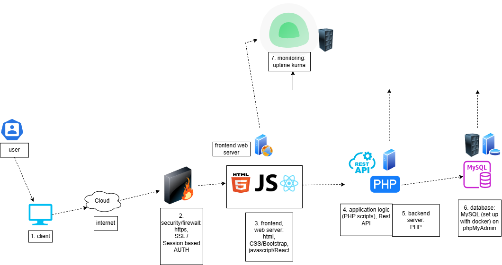

//Full Project Information + Documentation   

# IS436-TECHLOCK: EMPLOYEE DATABASE PLATFORM
  
sponsored by:    

# Documentation

## Table of Contents
* [Overview](#overview)
* [Project Objective](#objectives)
* [Features of EDP](#features-of-edp)
 	* [Creating or Logging into an Account](#creating-or-logging-into-an-account)
	* [Accessing and Updating Tasks](#accessing-and-updating-tasks)
* [Project Timeline](#project-timeline)
* [*System Design*](#5-phases-of-system-design)
	* [Planning](#planning)
 		* [Systems Request](#systems-request)
   		* [Feasibility Analysis](#feasibility-analysis)
 	* [Analysis](#analysis)
  	* [Design](#design)
  		* [System Architecture](#system-architecture)
  	 	* [Database Design](#database-design-erd)	 	 
  	* [Implementation](#implementation)
  		* [Docker](#docker) 
  	* [Operation and Maintenance](#operation-and-maintenance)   	
* [Diagrams & Visualization](#diagrams)
* [Technologies](#technologies)
* [Hardware & software specifications](#specifications)
* [Limitations](#limitations)
* [Group Members](#members)

### Overview
Employee database platform (EDP) is a web based platform that handles and manages the data and user profiles of the employees in an organization. The platform provides a centralized view of employee data, task management, and report generation, etc. EDP allows administrators and managers to manage employee profiles, assign and view tasks in an ordered dashboard. With a focus on scalability and accessibility.

### Objectives

### Features of EDP
This website has multiple features that are very useful to employees and Human Resource Managers

##### Employee Database Dashboard

Our employee management system provides a dashboard allowing for organization of employee information. Access employee record information to view tasks or their profiles.

##### Manage Tasks

Employees and managers can view and update their current open tasks. The Task manager displays information like task name, task completion status, description, and more. This task can be updated or removed by the employee and manager. Employees and managers can also add new tasks. 

##### Search Employees

A user can search for employees in the company using information about the employees. Employees can be searcher for by their name or activity description

##### Access to Details

Employee accounts can be drilled into to access more information on them. This includes email, department, job position, date started and more. This data can be updated by the user. Tasks can also be viewed from the employee profile screen

##### Self-service Portal

The Self-service portal empowers employees to update personal information and manage their current tasks. This enhances transparency and reduces administrative workload

#### Creating or Logging into an Account

##### Creating an Account

Employees and managers will have to create an account to access and update information about their tasks. 

The user must first access the account page of the website

If the user is new and does not have an account, they should fill out all of the required information like name, email, etc. 

Once they have that information filled out, they can click "Register" which will bring them to the log in screen

##### Logging in

The user should enter their email address and password to login into their account

#### Accessing and Updating Tasks

##### Viewing Tasks 
From the Profile screen tasks can be viewed and managed. 

The tasks section of the profile page contains task name, status, description, deadline, and action. This data is displayed in rows and columns to allow for optimal view and editing experience. 

##### Updating and Removing Tasks

When a user clicks on the update button a new window opens that allows for the details of that task to be edited and saved

Tasks can also be removed by clicking the "Remove" button.

##### Adding Tasks

To add a new task a user can scroll down to the "Add New Task" section

To add a new task the user must fill out a task name, status, description, and deadline. Then click "Add Task" for the task to be added to the "Tasks" section above

### Project Timeline

### 5 phases of System Design
The 5 phases of system design make up the foundation behind how the system will be built. 

#### Planning

##### Systems Request
	
*Project Sponsor:* BG Solutions 

*Business need:* This project has been initiated to allow for the efficient management of all employee data through an online website. BG Solutions needs an all-encompassing platform to host information about their employees. This web platform has to be scalable to accommodate their increasing company size. 
Currently, BG Solutions relies on different online applications to handle different aspects of their employees’ information. They need a centralized system that can handle everything in one place. This would vastly improve operational efficiency, data accuracy, and streamline the management of employees’ tasks.  

*Business requirements:* Using the Employee Database Platform, administrators at BG Solutions will be able to search for specific employees and look at all current tasks assigned to them, along with their personal information (depending on admin’s security privileges). They will also be able to group and sort different employees based on their preferred criteria. The specific functionality that the system should have includes the following:  
* Create, edit, and delete employee account
* Choose the type of employee account and populate employee information based on the type of account.
* Assign the employee account to a specific group/manager.
* Enable managers to access specific information of their employees, and assign + monitor tasks accordingly.
* Search, filter, and sort functionality.
* Automatic reminders and updates for employees regarding their assigned tasks.
* Need a secure login system with 2FA.
* Generation of customized (employee and department) reports based on modifiable criteria.  

*Business value:* We expect that BG Solutions will improve their operational efficiency, leading to faster project turnaround time and an increase in overall sales during the same time frame - compared to their performance before the adoption of the Employee Database Platform. We expect to gain a new revenue stream from scaling this employee database platform to align to the needs of other businesses. We expect to gain both the initial setup amount and the monthly maintenance required for the database platform from BG Solutions and potential future clients. 
Estimates of tangible and intangible value to the company include the following:  
* Reduction of hardware costs over 3 years: $1,100,000
* Reduction of IT service desk calls over 3 years: $210,000
* Reduction of IT costs of legacy systems: $500,000
* 10% increase in employee productivity (saving $40,000)
* Improved employee satisfaction with online systems  

*Special issues or constraints:* The website needs to be completed in 6 months to meet the deadline set by BG Solutions. This project is necessary for BG Solutions’ operations. The system must be extremely secure in order to protect sensitive employee data and information. It is important that the website be scalable to handle the growing employee numbers.    
 
##### Feasibility Analysis
*Technical Feasibility*: The Employee Database Platform will include features like user account management, employee information tracking, and task management. For the front end, we will use HTML, JavaScript, and modern frameworks, and for the back end, Python or PHP. Database management will use relational or NoSQL databases, and the system will leverage cloud infrastructure for scalability and security. Challenges include integrating with existing systems and ensuring consistent uptime and data security.  

*Economic Feasibility:* The Employee Database Platform development costs include initial expenses like hiring or utilizing in-house developers, setting up infrastructure, and acquiring software licenses. Operating costs include maintenance, updates, and monthly hosting fees. The system will streamline employee management processes, improve tracking, and centralize data, leading to long-term savings. The budget should consider initial and long-term costs, as well as contingencies for unexpected expenses.  

*Organizational Feasibility:* The success of the Employee Database Platform depends on strong stakeholder support, starting with buy-in from executives, especially HR, IT, and operations managers. End users should be involved early in the design process to ensure the platform is user-friendly. A comprehensive training plan and user documentation will be essential. The IT department must offer ongoing support and assist with scaling the system. The organization must assess its readiness and ensure alignment among key departments for the adoption of the digital employee management platform.  

*Legal and Ethical Feasibility*: To effectively safeguard employee data, the Employee Database Platform must adhere to both local and international regulations, including GDPR, regarding data privacy. The platform must prioritize the protection of personal identification information (PII) in accordance with these privacy laws. Implementing security measures such as encryption, two-factor authentication, and regular audits will play a vital role in fortifying the defense against potential breaches and ensuring legal compliance.  

#### Analysis
* Interviews
* Questionnaire
* Documents Analysis
* Requirements Definition (Functional / Non-functional)
* Use Case Analysis
* Data Flow Diagrams

#### Design

##### System Architecture

##### Database Design ERD

#### Implementation
##### Docker
* Environment Setup
	* Installation of Docker to local environment to simplify the deployment process. Docker-compose.yaml file to manage the application and database containers. 	
* EDP website development.
	* Focus on [frontend, backend, and database](#technologies). Frontend: a user-friendly interface for employees to manage and view profiles and tasks. Backend: Handle data operations, (CRUD) employee records. Connect to database.
* Containerization and Deployment
	* Site and code were packaged into Docker containers to simplify the hosting and ensure consistency across multiple systems. Deployed website accessible on local host. 
* Testing / Debugging
	* Website was constantly tested after every commit to ensure that all features were working as intended. Any errors found during the testing phase were fixed before deployment. 
* Documentation Write up
	* Project Documentation written using README.md file.  

#### Operation and Maintenance
* Monitor system performance using Uptime Kuma.
* Automatic backups to database.
* Address any user feedback (bugs and errors).
* Periodic updates with new features and site enhancements.
  
### Diagrams
* [Use Cases](#use-case-diagram)
* [Data Flow Diagrams (DFDs)](#data-flow-diagram)
* [Entity Relationship Diagram (ERD)](#database-design-erd)
* [System Architecture Diagram](#system-architecture)

#### Use Case Diagram

#### Data Flow Diagram

### Technologies
* **Frontend:**   
	* HTML
	* CSS 
	* Javascript 
	* Bootstrap (Responsible for User Interface - accessing and interacting with EDP)  
 * **Backend:**   
	* PHP 
	* Rest API (Server side logic)  
* **Database:**  
	* MySQL (Configured in phpMyAdmin set up with Docker)  
* **Monitoring:**  
	* Uptime Kuma (Monitoring and Alerting tool to monitor system performance)  
* **Security:**   
	* HTTPS 
	* SSL (Session based authentication)  
* **Visualization/diagrams:**   
	* Draw.io  (For creation of ERD and architecture diagrams)  
* **IDE:**  
	* VS Code   
* **Version Control:**   
	* Github Repository (To manage versioning and collaboration)  

* **Programming Languages**  
	* Frontend: 
		* HTML
 		* CSS
		* Javascript. 
	* Backend: 
		* PHP 
 	* Database: 
 		* SQL queries.

### Specifications
#### Hardware

|Client| Web Server| Application Server| Database Server|
|---- | ----| ----| ----|
|i7 processors, 16GB RAM, 512 GB storage|dual core Intel Pentium Processors, 2 GB RAM, 500 GB drive | quad core Intel Pentium Processors, 4GB RAM, 500 GB drive| dual core Intel Pentium Processors, 4 GB RAM, 500 GB drive |

| More Specifications      | Client     | Web server  | Application Server  | Database Server  |
| ----------------- |---------| -----|--- |---|
| Operating System  | Windows 10 | Linux | Linux | Linux|
| Network     | 1 Gig Ethernet Or company provided WiFi  |10 Gig hookup w/ 3 backup lines |10 Gig hookup w/ 3 backup lines |10 Gig hookup w/ 3 backup lines |

#### Software

[Software Specifications](#technologies)

### Limitations
Our work does not fully encompass the needs of the EDP. For example, scalability is an issue that might arise in the future as the number of employees / companies using EDP grows, massively increasing the amount of data that the database has to store. We plan to tackle this potential problem by multiplying the number of servers we use. We also aim to explore the incorporation of cloud computing in our system, possibly by using cloud services to host our front end or back end. 

### Members
* *_Savannah Park : Frontend Developer / Budget Analyst_*
* *_Patrick Holsonbake : Database Developer_*
* *_Shanti Budha : Backend Developer_*
* *_Derah Obelle : Project Manager / Backend Developer_*
* *_Natan Woldemichael : Systems Analyst_*

